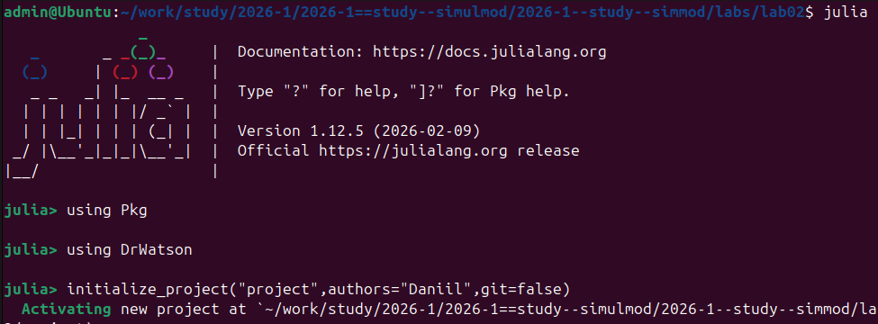
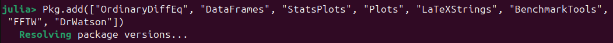
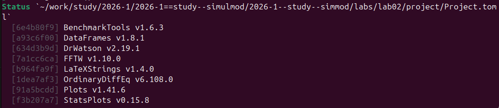
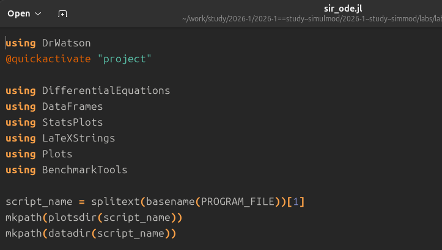
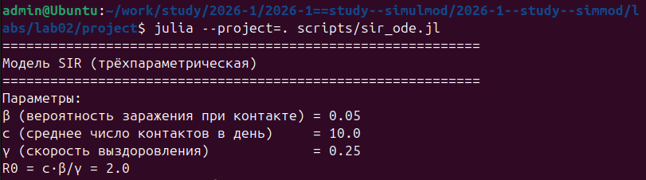
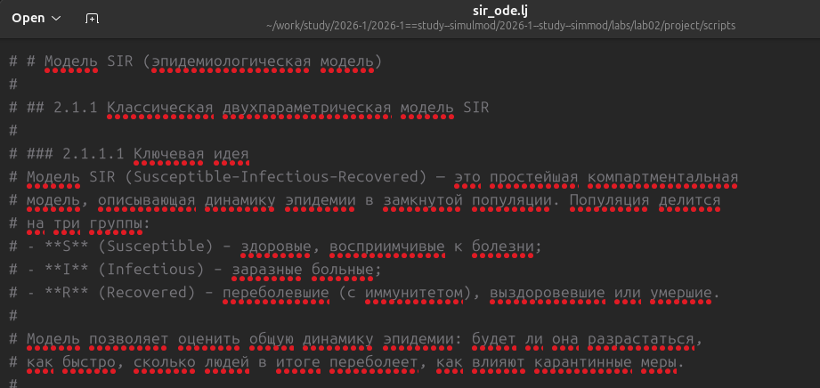
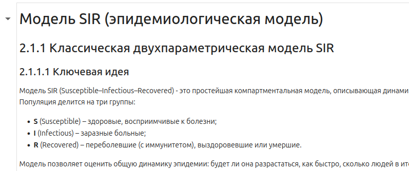

---
author:
  name: Казазаев Даниил Михайлович
  email: 1132231427@rudn.ru
  affiliation:
    - name: Российский университет дружбы народов
      country: Российская Федерация
      postal-code: 117198
      city: Москва
      address: ул. Миклухо-Маклая, д. 6
title: "Отчет"
subtitle: "Лабораторная работа №2"
license: "CC BY"
---

```{julia}
using Plots
Plots.default(fmt = :png)
```

# Цель работы

Изучение математических моделей SIR (эпидемиологическая) и Лотки–Вольтерры (хищник-жертва), их реализация на языке Julia, проведение вычислительных экспериментов и анализ полученных результатов.

# Задание

1. Создать рабочий каталог для кода и проект DrWatson.
2. Установить необходимые пакеты.
3. Выполнить предложенный код для модели SIR и Лотки–Вольтерры.
4. Преобразовать код в литературный стиль.
5. Сгенерировать из литературного кода чистый код, Jupyter notebook и документацию в формате Quarto.
6. Выполнить код из Jupyter notebook.
7. Интегрировать документацию в формате Quarto в отчёт.
8. Добавить в литературный код вычисления для набора параметров.
9. Сгенерировать из литературного кода с параметрами чистый код, Jupyter notebook и Quarto-документ.
10. Выполнить параметрический ноутбук.
11. Интегрировать параметрическую документацию в отчёт.

# Теоретическое введение

## Модель SIR

Модель SIR описывает динамику трёх групп населения:
- S – восприимчивые к болезни;
- I – заразные больные;
- R – переболевшие (с иммунитетом).

Система дифференциальных уравнений трёхпараметрической модели описывает скорость изменения числа восприимчивых, заразных и переболевших. Скорость уменьшения числа восприимчивых пропорциональна произведению числа заразных и доли восприимчивых в популяции. Скорость изменения числа заразных определяется разностью между новыми заражениями и выздоровлениями. Скорость увеличения числа переболевших пропорциональна числу заразных.

Параметры модели: бета – вероятность передачи при контакте, c – среднее число контактов в день, гамма – скорость выздоровления. Общая численность популяции N остаётся постоянной. Базовое репродуктивное число R0 равно произведению c и бета, делённому на гамма. Оно определяет порог эпидемии: если R0 больше 1, заболеваемость растёт.

## Модель Лотки–Вольтерры

Модель взаимодействия хищников и жертв описывает изменение численности жертв x и хищников y. Скорость роста жертв пропорциональна их численности, но уменьшается из-за встреч с хищниками. Скорость роста хищников пропорциональна числу встреч с жертвами, но уменьшается из-за естественной смертности.

Параметры модели: альфа – рождаемость жертв, бета – интенсивность хищничества, дельта – коэффициент конверсии биомассы (эффективность использования жертв для размножения хищников), гамма – смертность хищников.

Равновесие системы достигается в точке, где численность жертв равна гамма, делённой на дельта, а численность хищников равна альфа, делённой на бета. В классической модели колебания носят незатухающий характер.

# Выполнение лабораторной работы

## Подготовка окружения

Перед началомвыполнения лабораторной работы, перехожу в папку курса. 

{#fig-001 width=70%}

В соответствии с методическими указаниями был создан проект DrWatson для второй лабораторной работы в каталоге `labs/lab02/project`. 

{#fig-001 width=70%}

Устанавливаю необходимые пакеты: OrdinaryDiffEq, DataFrames, Plots, LaTeXStrings, FFTW, BenchmarkTools.

{#fig-001 width=70%}

{#fig-001 width=70%}

Переношу код програмы модели SIR из файла лабораторной работы.

{#fig-001 width=70%}

После переноса запускаю и проверяю работоспособность программы.

{#fig-001 width=70%}

Создаю файл с расширением .lj в котором записываю код программы в литературном стиле.

{#fig-001 width=70%}

Проверяю файл в jupyther.

{#fig-001 width=70%}

После выполнения программы в jupyther, проверяю, созранились ли графики в каталое.

{#fig-001 width=70%}

Для программы модели Лотки–Вольтерры делаю аналогичные действия.

## Модель SIR

Исходный код модели SIR (трёхпараметрическая форма) был реализован в файле `scripts/sir_ode.jl`, а затем преобразован в литературный формат `sir_ode.lj`. С помощью скрипта `tangle.jl` из литературного кода сгенерированы чистый скрипт, Jupyter notebook и Quarto-документ. Ниже представлены полученные графики.


На полученных графиках видна характерная динамика: экспоненциальный рост числа заражённых, достижение пика и последующий спад. Эффективное репродуктивное число Re падает ниже единицы после пика, что соответствует затуханию эпидемии.

## Модель Лотки–Вольтерры

Аналогичные действия выполнены для модели Лотки–Вольтерры. Литературный код `lv_ode.lj` включает описание модели, её параметры, вычисление стационарных точек и построение нескольких типов графиков: временные ряды, фазовый портрет, спектральный анализ.


Результаты моделирования демонстрируют циклические колебания численностей, сдвиг фаз между жертвами и хищниками, а также замкнутую траекторию на фазовой плоскости. Спектральный анализ подтверждает наличие доминирующей частоты колебаний. Полученные зависимости хорошо согласуются с теоретической формулой периода малых колебаний.

# Выводы

В ходе лабораторной работы были реализованы две классические модели: эпидемиологическая SIR и экологическая Лотки–Вольтерры. Проведены вычислительные эксперименты, построены графики динамики, фазовые портреты, спектральные характеристики. Полученные результаты соответствуют теоретическим ожиданиям: в модели SIR наблюдается пороговое поведение (при R0 больше 1 возникает эпидемия), в модели Лотки–Вольтерры – устойчивые незатухающие колебания численностей. Работа выполнена в полном объёме в соответствии с заданием.

