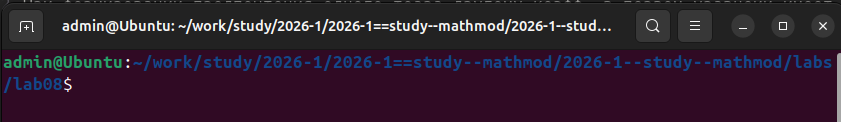
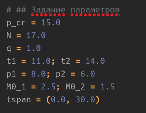
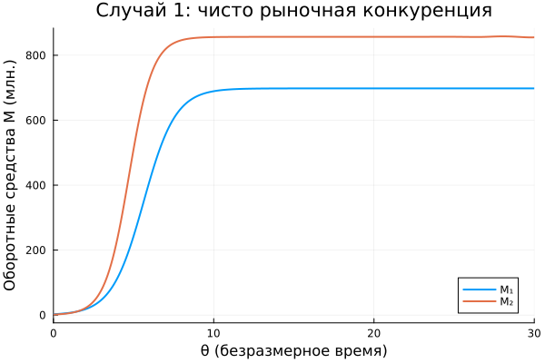
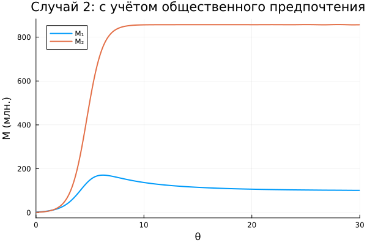

---
author:
  name: Казазаев Даниил Михайлович
  email: 1132231427@rudn.ru
  affiliation:
    - name: Российский университет дружбы народов
      country: Российская Федерация
      postal-code: 117198
      city: Москва
      address: ул. Миклухо-Маклая, д. 6
title: "Лабораторная работа №8"
subtitle: "Модель конкуренции фирм"
date: today
date-format: "YYYY-MM-DD"
license: CC BY
---

# Вводная часть

## Актуальность

- Моделирование конкуренции фирм позволяет анализировать рыночную динамику и влияние различных факторов.
- Взаимозаменяемые товары – распространённая рыночная ситуация, где важны себестоимость и потребительские предпочтения.
- Даже малые социально-психологические эффекты могут привести к банкротству одного из игроков.

## Цели и задачи

- Изучить модель конкуренции двух фирм.
- Реализовать численное моделирование на Julia.
- Построить графики для двух случаев.
- Найти стационарные состояния для первого случая.
- Оформить код в литературном стиле, сгенерировать Jupyter Notebook и Quarto-документ.

## Материалы и методы

- **Язык программирования:** Julia
- **Пакеты:** DrWatson, DifferentialEquations, Plots, DataFrames, JLD2, Literate
- **Структура проекта:** DrWatson 

# Теоретическое введение

## Модель одной фирмы

- Функция спроса пороговая
- Динамика оборотных средств приводит к двум стационарным точкам – одна устойчива (стабильная работа), другая неустойчива (банкротство).

## Конкуренция двух фирм (случай 1)

Уравнения после нормировки(постоянные издержки пренебрежимо малы):

Коэффициенты выражаются через параметры фирм.

## Случай 2 (социально-психологический фактор)

В первом уравнении добавляется малая положительная поправка к перекрёстному члену.

Это моделирует формирование общественного предпочтения товара второй фирмы, что усиливает негативное влияние на первую фирму.

## Стационарные состояния (случай 1)

Приравнивая производные к нулю, получаем линейную систему для ненулевого решения.

Решая её, находим устойчивую стационарную точку.

# Описание скриптов

В ходе работы созданы следующие файлы в проекте DrWatson:

- **scripts/model.jl** – основной литературный скрипт, реализующий моделирование для варианта 1:
  - задание параметров (вариант 1 из задания);
  - расчёт коэффициентов;
  - численное решение ОДУ для случая 1 и случая 2;
  - построение и сохранение графиков;
  - вычисление и вывод стационарных значений.
- **scripts/tangle.jl** – скрипт для генерации из литературного исходника чистого скрипта, Quarto-документа и Jupyter Notebook.

# Выполнение лабораторной работы

## Подготовка окружения

Переход в каталог курса и создание проекта DrWatson в `labs/lab08/project`.

{width=60% fig-align="center"}

## Установка пакетов и создание модуля

Установлены пакеты: `DrWatson`, `DifferentialEquations`, `Plots`, `DataFrames`, `JLD2`, `Literate`.

{width=40% fig-align="center"}

## Cкрипт `model.jl`

В скрипте заданы параметры варианта 1.

{width=40% fig-align="center"}

## Запуск моделирования

После запуска скрипт решает систему ОДУ, строит графики и сохраняет их в `plots/`, а также сохраняет данные в JLD2-файл.

{width=60% fig-align="center"}

## Генерация производных форматов

Запуск `tangle.jl` создаёт чистый скрипт, Quarto-документ и Jupyter Notebook. Ноутбук выполнен, результаты совпадают с исходными.

{width=60% fig-align="center"}

# Литературный стиль

- Исходный код оформлен как литературная программа: строки, начинающиеся с `#`, – Markdown, остальное – код Julia.
- Это позволяет создавать самодокументируемые скрипты, удобные для анализа и воспроизведения.
- Сгенерированные Jupyter Notebook и Quarto-документ полностью соответствуют результатам работы.

# Результаты моделирования

## Случай 1: чисто рыночная конкуренция

Обе фирмы выходят на устойчивые стационарные уровни. Фирма 2 имеет более высокие оборотные средства благодаря меньшей себестоимости.

{width=45% fig-align="center"}

## Случай 2: с социально-психологическим фактором (\(\delta=0.001\))

Фирма 1 после начального роста начинает нести убытки и её оборотные средства падают почти до нуля (банкротство). Фирма 2 сохраняет уровень, близкий к случаю 1.

{width=45% fig-align="center"}

## Анализ стационарных состояний

Для случая 1:
- Тривиальное – неустойчиво.
- Ненулевое – устойчивый узел.

Это соответствует экономическому смыслу: при нулевых оборотных средствах фирмы не могут работать, при положительных – достигают равновесия.

# Выводы

- Реализована математическая модель конкуренции двух фирм на языке Julia с использованием DrWatson и DifferentialEquations.
- Для варианта 1 выполнены численные расчёты и построены графики для двух случаев.
- Показано, что в чисто рыночной конкуренции обе фирмы сосуществуют, выходя на устойчивые уровни.
- Введение даже малого социально-психологического фактора (0.001) может привести к банкротству одной из фирм.
- Найдены стационарные состояния для первого случая, проведён анализ устойчивости.
- Все скрипты переведены в литературный стиль, сгенерированы Jupyter Notebook и Quarto-документы.
- Работа выполнена в полном объёме согласно заданию.
