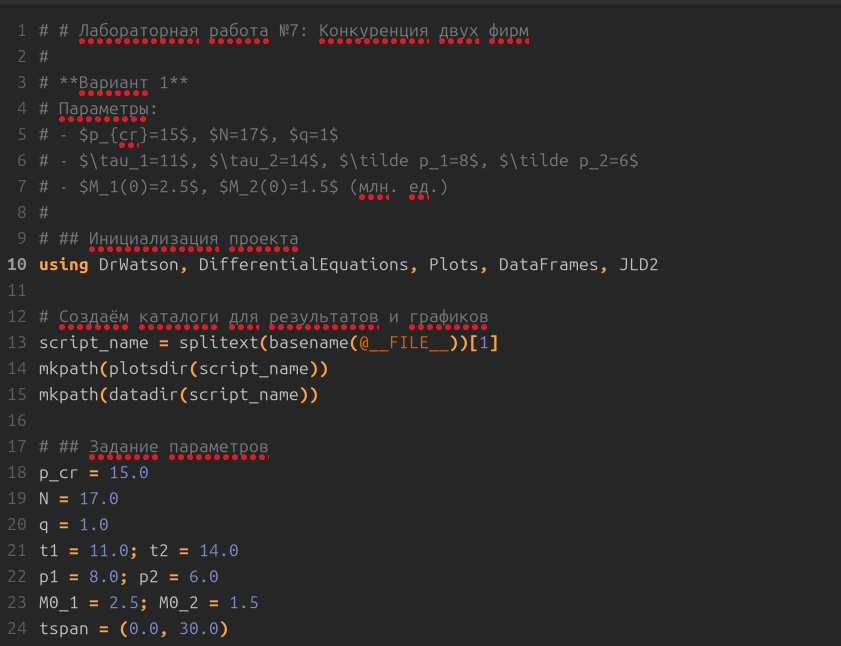

---
author:
  name: Казазаев Даниил Михайлович
  email: 1132231427@rudn.ru
  affiliation:
    - name: Российский университет дружбы народов
      country: Российская Федерация
      postal-code: 117198
      city: Москва
      address: ул. Миклухо-Маклая, д. 6
title: "Отчет"
subtitle: "Лабораторная работа №8"
license: "CC BY"
---

# Цель работы

Иизучение математической модели конкуренции двух фирм, которые производят взаимозаменяемые товары одинакового качесва. Реализация численного моделирования динамики оборота средств в двух случаях: чисто рыночная конкуренция и с учетом соц.-психологических факторов. Анализ стационарных состояний и чувствительности параметров.

# Задание

1. Придумать свой пример конкурирующих фирм, производящих одинаковые товары(Вариант 1). Задать начальные параметры. Построить графики изменеиня оборотных средств для каждой фирмы.
2. Проанализировать полученные результаты.
3. Найти стационарное состояние системы для первого случая.
4. Реализовать модель на языке программирования julia, сгенерировать Jupyter Notebook и Quarto-документы.

# Теоретическое введение

## Модель одной фирмы

В основе моделил ежит представление о фирме, которая производит продукт долговременного пользования. Цена определяется балансом спроса и предложения. Функция спроса имеет пороговый вид.

Динамика оборотных средств описывается дифференциальным уравнением, а рыночная цена быстро стремится к равновесному значению. В результате для одной фирмы получается уравение с двумя стационарными состояниями, одно из которых устойчиво и соответствует стабильной работе.

## Конкуренция духф фирм

В лабораторной работе рассматриваются две фирмы. Потребители не имеют предпочтений. Уравнения динамики оборотных средств после нормировки и пренебреженеия постоянными издержками принимают вид, где коэффициенты выражаются через параметры фиррм.

## Случай 2

При формировании предпочтения одного тоара другому коэфф. в первом уравнеии имеет малую добавку в 0.001.

В варианте 1 этот коэф. константен. Это моделирует негативное влияние присутсвия второй фирмы на первую из-за предпочтений потребителя.

# Выполнение лабораторной работы

## Подготовка окружения

Перед началом выполнения лабораторной работы, перехожу в папку курса. 

{#fig-001 width=70%}

В соответствии с методическими указаниями был создан проект DrWatson для лабораторной работы в каталоге `labs/lab08/project`. Устанавливаю необходимые пакеты: `DrWatson`, `DifferentialEquations`, `Plots`, `DataFrames`, `JLD2`.

После установки пакетов создаю скрипт `model.jl`, в котором реализую модель конкуренции.

{#fig-001 width=70%}

В скрипте задаю параметры для модели.

{#fig-001 width=70%}

После запуска скрипт сохраняет два графика и данные.

{#fig-001 width=70%}

После успешного запуска скрипта выполняю скрипт tangle.jl, который генерирует Jupyter Noteeebook.

{#fig-001 width=70%}

# Литературный стиль

Каждый файл был переделан в соответсвии с литературным стилем, который сочетает в себе интерпретацию Markdown в сочетании с Julia.

После чего генерируются файлы расширения .ipynb, которые я запускаю в Jupyther и сверяю с прошлым результатом скриптов. Результат совпал.

# Результаты моделирования

## Случай 1: чистая рыночная конкуренция 

На графике ваидно, что обе фирмы достигают стационарных уровней и остаются на рынке. Фирма 2 имеет более ысокие оборотные средства, что связано с ее более низкой совместимостью и более длинным циклом. Кривые гладкие и монотонно возрастают до равновесия.

## Случай 2: учет социально-психологического фактора

При добавлении малой обавки к перекрестному коэфф. первой фирмы динамика резко меняется. Фирма 1 после начального роста начинает нести убытки и ее оборотные средства практически паадают до нуля. Фирма 2 при этом выходит на тот же уровень, что и в случае 1, не испытывая дополнительного давления.

## Аналлиз стационарных состояний

Для случая 1 система имеет два стационарных состояния: тревиапльное (0, 0) - неустойчивое и ненулевое - устойчивое. Это соответсвует экономическому смыслу: при нулевых оборотных средствах фирмы не могут функционировать, а при положительных - выходят на равновесие.

# Выводы

- Реализован модуль конкуренции двух фирм на языке Julia с использованием пакетов `DrWatson` и `DifferentialEquations`.

- Для варианта 1 выполнены численные расчеты и построены графики динамики оборота средств для двух случаев.

- Показано, что в случае чисто рыночной конкуренции обе фирмы сосуществуют, достигая устойчивых стационарных уровней.

- Проверен случай с введенным соц.-псих. фактором, коорый приводит к банкротству одной из фирм, что подчеркивает важность потребительских предпочтений.

- Все скрипты переведены в литературный стиль, сгенерированы Jupyter Notebook и Quarto-документы.

- Работа выполнена в полном объёме согласно заданию.
